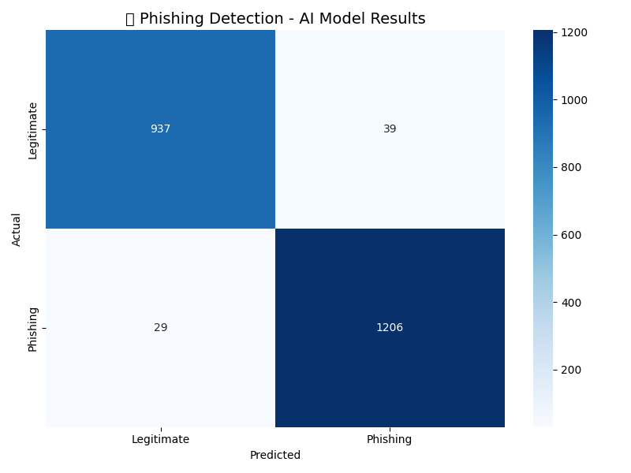
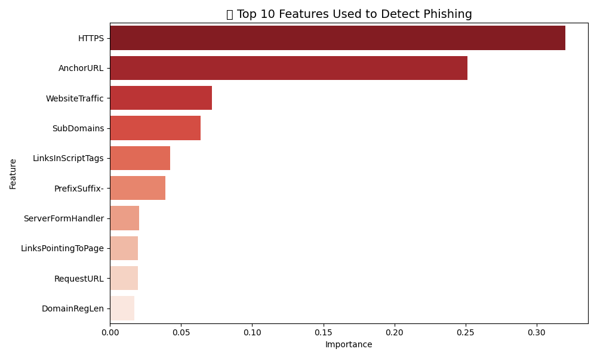

# 🛡️ AI Phishing Website Detector

An AI-powered machine learning model that detects phishing websites with **96.92% accuracy** using Random Forest Classification.

---

## 📌 Overview

Phishing attacks are one of the most common cybersecurity threats today. This project uses machine learning to automatically classify websites as **legitimate or phishing** based on 30+ URL and website features — no manual analysis needed.

---

## 🎯 Key Results

| Metric | Score |
|--------|-------|
| ✅ Accuracy | **96.92%** |
| 🌲 Model | Random Forest Classifier |
| 📊 Dataset Size | 11,054 websites |
| 🔍 Features Used | 30 website attributes |

---

## 🔍 How It Works

The model analyzes 30+ features of a website including:
- Whether the URL uses an IP address instead of a domain
- Presence of suspicious symbols like `@` in the URL
- URL length (phishing URLs tend to be unusually long)
- Use of URL shorteners
- Presence of HTTPS and SSL certificates
- Domain age and registration details
- And many more...

These features are fed into a **Random Forest Classifier** which learned patterns from thousands of real phishing and legitimate websites.

---

## 📊 Visualizations

### Confusion Matrix


### Top Features Used by the AI


---

## 🛠️ Technologies Used

- **Python** — Core programming language
- **Scikit-learn** — Machine learning model
- **Pandas & NumPy** — Data processing
- **Matplotlib & Seaborn** — Visualizations
- **Google Colab** — Development environment

---

## 📁 Project Structure

```
ai-phishing-detector/
│
├── phishing_detector.ipynb   # Main notebook with full code
├── phishing_model.pkl        # Saved trained AI model
├── feature_names.pkl         # Feature names used by model
├── results.png               # Confusion matrix chart
└── features.png              # Feature importance chart
```

---

## 🚀 How to Run

1. Clone this repository
```bash
git clone https://github.com/YOUR_USERNAME/ai-phishing-detector.git
```

2. Open `phishing_detector.ipynb` in Google Colab or Jupyter Notebook

3. Upload the `phishing.csv` dataset and run all cells

---

## 📚 Dataset

- **Source:** Kaggle — Phishing Website Detector Dataset
- **Size:** 11,054 samples
- **Features:** 30 website attributes
- **Labels:** Phishing (-1) or Legitimate (1)

---

## 👨‍💻 Author

**Your Name**  
Cybersecurity & AI Enthusiast  
📧 your.email@gmail.com  
🔗 [LinkedIn](https://linkedin.com/in/yourprofile)

---

## ⭐ If you found this useful, please star the repository!
